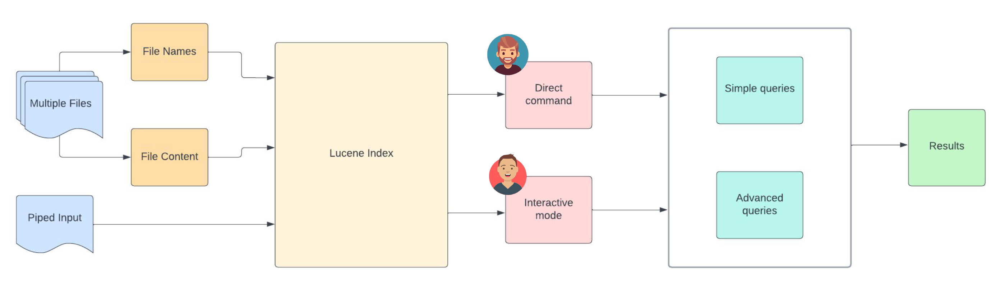

# lfind


`lfind` is a command line tool built entirely in java that leverages Apache Lucene for efficient searching across files and directories in the file system.

## Features

- **Interactive and Direct Command Modes**: lfind supports both interactive mode for iterative search queries and direct command mode for quick one-time searches.
- **Search File Names and Content**: Easily search for file names and within file content across various file types including PDFs, Word documents, and plain text files.
- **Advanced Query Support**: Supports a wide range of query types including boolean, phrase, partial, wildcard, and prefix queries—leveraging the full querying capabilities of Lucene.
- **Piped Input Support**: Integrates seamlessly into bash scripting with support for piped inputs, allowing lfind to be combined with other commands in powerful workflows.
- **Cross-Platform Compatibility**: Works on any machine with Java installed. Tested on macOS, Windows, and expected to run smoothly on Linux environments.
- **Rich Command Line Interface**: Powered by picocli, lfind provides a user-friendly and feature-rich command line experience.
- **Automatic Index Cleanup**: lfind automatically cleans up index files upon safe termination of the application, ensuring efficient resource management.

## Process Flow



## Installation

### Requirements

- java 11 or higher (tested using [Amazon Corretto 11](https://docs.aws.amazon.com/corretto/latest/corretto-11-ug/downloads-list.html))
- Tested in both windows 11 and Mac M3 Pro

### How to run

1. **Download the Package**

    - For **Windows** users, navigate to `src/main/resources/windows-pkg` and run `lfind.bat`.

    - For **Mac** users, navigate to `src/main/resources/mac-pkg` and run `lfind.sh`.

2. **Run the Application**

    - **Mac**:
      ```bash
      ./lfind.sh [options] <queries>
      ```

    - **Windows**:
      ```bash
      .\lfind.bat [options] <queries>
      ```

### Adding to Environment Path (Optional)

To access `lfind` from anywhere in the terminal, you can add the appropriate folder (`src/main/resources/windows-pkg` for Windows or `src/main/resources/mac-pkg` for Mac) to your system's environment path.

- **Mac**:
  ```bash
  export PATH=$PATH:/path/to/src/main/resources/mac-pkg
  ```
- **Windows**:
  ```bash
  setx PATH "%PATH%;C:\path\to\src\main\resources\windows-pkg"
  ```

## Usage

Ensure that you have followed the steps in the `Adding to Environment Path` section of the README. If not, run the following commands from the appropriate path.


### Running Direct Commands

```bash
lfind [options] <query>
```

### Running in Interactive Mode

```bash
lfind [options]
```

### Options

- `-c, --content`: Enable searching within file content (default: false).
- `-e, --expression`: Treat queries as Lucene query expressions (default: false). When enabled, all queries are interpreted as Lucene queries.
- `-h, --help`: Display help message and exit.
- `-m, --mimetypes=<mimeTypes>`: Specify MIME types to include in content search (comma-separated, e.g., pdf,doc,text). Default is no filter; used only in content search mode.
- `-p, --path=<directory>`: Specify the starting path for the search (default: current working directory).
- `-v, --verbose`: Enable verbose mode to print useful debugging information.

### Examples

#### File name search

Search for a term (substring) in the file names:

```bash
lfind "query"
```

Search for a term 


## Contributing Guidelines

1. Bug Reports and Feature Requests
    - If you encounter a bug or have an idea for a new feature, please open an issue on GitHub to report it.
    - Provide detailed steps to reproduce the bug, including any relevant error messages or screenshots.
    - Clearly describe the expected behavior or propose your feature idea.
2. Code Contributions
   - Fork the repository and create a new branch for your changes.
   - Ensure your code follows the project's coding style and conventions.
   - Write clear, concise commit messages that explain the purpose of each change.
   - Open a pull request (PR) with a descriptive title and detailed description of your changes.
3. Documentation
   - Improve existing documentation or write new documentation for features or APIs.
   - Update the README file with any necessary information for users and contributors.

## Future Scope

While `lfind` currently provides powerful file system searching capabilities, there are several potential areas for future improvement and expansion:

- **Performance Optimizations**: Investigate methods to further optimize indexing and searching for larger file systems, enhancing speed and efficiency.

- **Additional File Types**: Expand file type support to include a broader range of formats, enabling comprehensive searching across various file types.

- **Enhanced Result Details**: Enhance result output by providing additional details such as matched lines within files or specific substrings matched during content-based searches.

- **File Monitoring and Precomputed Indexing**: Implement precomputed indexing and background file monitoring to maintain index consistency and accelerate search processes.

- **Custom Ranking and Scoring**: Customize the ranking and scoring functions to tailor search results based on specific file system retrieval tasks, such as boosting file matches over folder matches or prioritizing exact matches.

- **Query Optimization**: Optimize query processing internally to improve search performance, particularly for token-based searches using wildcard queries.

- **Improved Packaging**: Explore solutions to resolve compatibility issues with GraalVM, potentially downgrading the Lucene version or adopting other strategies for efficient packaging.

- **User Interface (UI)**: Develop a graphical user interface (GUI) version for users who prefer a visual interaction.

- **Advanced Search Filters**: Implement advanced search filters based on file attributes, metadata, or content properties to refine search results based on specific criteria.

- **Internationalization (i18n)**: Add support for different languages and localization.

Contributions and suggestions for these or other enhancements are welcome! Please feel free to open an issue or submit a pull request to discuss and collaborate on the future development of `lfind`.

## Contributors

- vva2
- mkr-peta
- bhavan-dondapati
- spchimmani

## License

- Licensed with Apache-2.0 license

